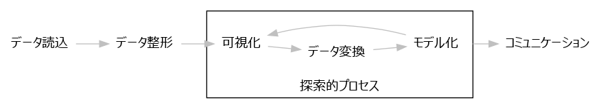

```{r setup, include=FALSE}
library(knitr)
library(ggpubr)
library(tidyverse)
library(broom)

# グラフ中の日本語の文字化け対策
#   出力フォーマットがPDF(TeX)の場合のみ実行される
if (knitr::opts_knit$get("rmarkdown.pandoc.to") %in% c("beamer", "latex")) {
  options(device = function(file, width = 7, height = 7, ...) {
    cairo_pdf(tempfile(), width = width, height = height, ...)
  })
  knitr::opts_chunk$set(dev="cairo_pdf", dev.args=list(family="VL Gothic"))
}

# Rコード部の設定
knitr::opts_chunk$set(echo = T, fig.align="center", warning = F)

# ggplotグラフで日本語を使えるようにする
old <- theme_set(theme_gray(base_family = "VL Gothic"))

# baseグラフで日本語を使えるようにする
par(family = "VL Gothic")

# 表出力用に、数値の有効桁数を限定する
options(digits = 5)
```


# データ分析プロセスは探索的

実験データ分析は探索的なプロセスです。
1回データ処理して終了することはあまりなく、多くの場合は仮説→検証を繰り返して適切な結果を得ることができます。[^1]
ここでは下図で示されるデータ分析プロセスの流れを、簡単な例を元に確認していきましょう。[^2]

[^1]:多角的な視点でデータ分析することは重要ですが、ツールの支援がなければ大きな負担になってしまいます。Rはデータ分析の全てのプロセスを支援できるツールです。
[^2]:ここではRの書き方の説明は行いません。データ分析の考え方を大まかに理解してください。この内容をすべて使えるようになったらこのコースは終了です。
また、この資料は『Rではじめるデータサイエンス』(2017)やRコンソーシアム、R Studioカンファレンスの発表を元にしています。




# 実験データを読み込む

まず行うのは、実験データを格納したデータファイルをRに読み込むことです。
Rでは、CSV（カンマ区切り）などのテキストファイルやExcelファイルを簡単に読み込むことができます。[^3]  
ただし、ここでは読み込む手順は省略し、Rに組み込みのテスト用データ`iris`を使うことにします。 使用するデータは生態学の計測データで、アヤメの花弁（petal）とガク（sepal）の長さと幅を、
3つの種について50個体ずつ計測したデータです。

```{r iris, echo=FALSE}
iris <- iris %>% as_tibble()
print(iris, n = 5)
```

[^3]:計測器には独自形式のバイナリファイルでデータを記録するものがありますが、その場合でもデータの分析を他のツールでも行えるように、データ変換機能が用意されていることがほとんどです。


# データを整形する

次に行うのは、読み込んだデータを分析に適した形に整形することです。例えば、複数の実験データを1つのExcelシートに混在させている場合、それぞれが区別できるように整える必要があります。[^4]  
ここで使用するデータは整った形をしていますが、部位ごとの寸法が変数（列）になっているのを、部位と寸法を別変数にした方が、この後の分析がやりやすくなります。

[^4]:余分なデータが含まれている場合など、データ読み込みの際に工夫する必要がある場合もあります。

そこで、以下のように整形します。なお、idは個体番号です。

```{r, echo=TRUE}
iris_long <- iris %>% 
  rowid_to_column("id") %>% 
  gather(key, value, matches("Length|Width")) %>% 
  separate(key, into = c("Part", "amount")) %>% 
  spread(amount, value)
```
```{r, echo=FALSE}
print(iris_long, n = 5)
```


# 可視化する

計測データには、測定系の不具合や人為的なミス、環境の影響などによる不正なデータが含まれていることがあります。まず生データを可視化し、正常なデータか確認することが重要です。  
ここでは長さと幅の関係を、種ごと＋部位ごとに確認してみることにします。

```{r, echo=TRUE, fig.cap="種ごと部位ごとに可視化する"}
iris_long %>% 
	ggplot(aes(x = Width, y = Length)) + 
	geom_point(aes(color = Part)) + 
	facet_grid(Part ~ Species) +
	labs(x = "幅(cm)", y = "長さ(cm)", color = "部位")
```

比較的バラツキの大きいデータなので問題ない範囲だと思いますが、setosaのガク（sepal）の幅が最小となるデータが他から少し外れているようです。


# データを変換する

データ分析の対象が、大量の計測データの一部だったり、計測データから求めた演算結果だったりする場合に行うデータ処理のことを、変換と呼びます。  
ここでは先ほどチェックしたときに注目したデータが計測ミスによる外れ値であると仮定して、除外してみましょう。

```{r, echo=TRUE, results='hide'}
iris_long <- iris_long %>% 
  filter(!(Species == "setosa" & Part == "Sepal" & Width < 2.5))
```


# モデル化する（仮説1）

長さと幅に相関があるか、95%信頼区間つきの近似直線[^5]を描いて確認してみましょう。
比較的よい相関があるようですが、よく見てみると、どの種でもガクの方が大きいようです。

[^5]:ここでいうモデルとは、仮説を確認できる数学的モデルのことです。この場合は、信頼区間つきの近似直線を描くことがモデル化です。

```{r, echo=TRUE, fig.cap="仮説1：長さと幅に相関がある"}
iris_long %>% 
	ggplot(aes(x = Width, y = Length)) + 
	geom_point(aes(color = Part)) + 
	stat_smooth(method = "lm", color = "gray 40") + 
	facet_grid(Part ~ Species) +
	labs(x = "幅(cm)", y = "長さ(cm)", color = "部位")
```


# モデル化する（仮説2）

もしかすると、長さと幅の関係は花弁とガクで共通と考えたほうがいいのかもしれません。
花弁とガクをまとめたグラフを作って、確認してみましょう。

```{r, echo=TRUE, fig.cap="仮説2：長さと幅の関係は部位で共通"}
iris_long %>% 
	ggplot(aes(Width, Length)) + 
	geom_point(aes(color = Part)) + 
	stat_smooth(method = "lm", color = "gray 40") + 
	facet_wrap(~ Species) +
	labs(x = "Width(cm)", y = "Length(cm)")
```

個別に描いていた近似直線と傾きが同じ程度なので、仮説は妥当だったようです。
更に見てみると、近似直線の傾きがどの種でも似ているようです。


# モデル化する（仮説3）

長さと幅の傾きは種が異なっても共通かもしれません。
傾きが確認しやすいようにグラフを作り変えて、確認してみましょう。

```{r, echo=TRUE, fig.cap="仮説3：傾きは同一に見える"}
iris_long %>% 
  ggplot(aes(Width, Length, color = Species)) + 
	geom_point(aes(shape = Part), size = 3) + 
	stat_smooth(method = "lm") +
	labs(x = "Width(cm)", y = "Length(cm)")
```

95%信頼区間（グレーの領域）を考慮すると、同じ傾きである可能性は高そうです。


# モデル化の結果を数値で取得する

いままではグラフで確認していましたが、モデル化の結果を数値で取得することもできます。
ここでは仮説3のモデル化の結果を見てみましょう。
係数は推定値と標準誤差がestimateとstd.errに、無相関のt検定の結果はstaticとp.valueに示されています。

```{r, echo=TRUE}
lm_coef <- iris_long %>% 
  group_by(Species) %>% 
  summarise(list(lm(Length ~ Width) %>% tidy())) %>% 
  unnest()
```
```{r, echo=FALSE, fig.height=2, fig.width=5.5, fig.cap="線形モデルの結果を確認する"}
lm_coef %>% ggtexttable(rows = NULL, theme = ggpubr::ttheme("mBlue")) %>% 
  table_cell_bg(color = "red", linewidth = 2, column = 3, row = 3) %>%
  table_cell_bg(color = "red", linewidth = 2, column = 3, row = 5) %>% 
  table_cell_bg(color = "red", linewidth = 2, column = 3, row = 7)
```

ここから95%信頼区間を求めるには、以下のように直接計算することもできますし、

```{r, echo=TRUE}
ci_lwr <- function(coef, err, n, p = 0.95) {
  coef -1 * err * qt(df = n - 2, p = 1 - (1 - p)/2)
}

ci_upr <- function(coef, err, n, p = 0.95) {
  coef +1 * err * qt(df = n - 2, p = 1 - (1 - p)/2)
}

lm_coef_ci <- lm_coef %>% 
  filter(term == "Width") %>% 
  group_by(Species) %>% 
  summarise(ci_lwr = ci_lwr(estimate, std.error, 100),
            ci_upr = ci_upr(estimate, std.error, 100))
```

以下のように信頼区間を求める関数を使うこともできます。

```{r, echo=TRUE}
lm_coef_ci <- iris_long %>% 
  group_by(Species) %>% 
  summarise(list(lm(Length ~ Width) %>% 
                   confint(., "Width") %>% as_tibble())) %>% 
  unnest()
```

その結果は以下のようになり、傾きが同一である可能性があるといえます。

```{r, echo=FALSE, fig.height=1.2, fig.width=2.2, fig.cap="仮説2：傾きは同一といえる"}
lm_coef_ci %>% ggtexttable(rows = NULL, theme = ggpubr::ttheme("mBlue"))
```


# モデル化の妥当性を確認する

モデル化が適切に行えているのか、残差の分布を確認してみましょう。
説明変数（Width）に対して残差のバラツキはほぼ均等のようですし、残差の分布も偏っていないようなので、問題ないでしょう。

```{r, echo=TRUE, fig.height=2, fig.width=5, fig.cap="残差プロットを確認してモデルをチェックする"}
lm_resid <- iris_long %>% 
  group_by(Species) %>% 
  summarise(list(lm(Length ~ Width) %>% augment())) %>% 
  unnest()

lm_resid %>% 
  ggplot(aes(Width, .resid)) + 
  geom_point(alpha = 0.4) + 
  facet_wrap(~ Species, scales = "free_x")

lm_resid %>% 
  ggplot(aes(x = .resid)) + 
  geom_histogram(bins = 8) + 
  facet_wrap(~ Species, scales = "free_x")
```


# 分析結果を伝える（コミュニケーション）

データ分析が終了しても、レポートを作成して結果を報告するプロセスが残っています。
Rで作成したグラフや表をコピー＋ペーストする方法では、量が多くなると効率が悪くなりますしミスが混入しやすくなります。
そこで、Rにはレポートを自動作成する機能も備わっています。[^6]

[^6]:この文書自体、Rで作成しています。また、Rのコードと結果を一緒にまとめることでデータ分析の再現可能性を高めることができます。


