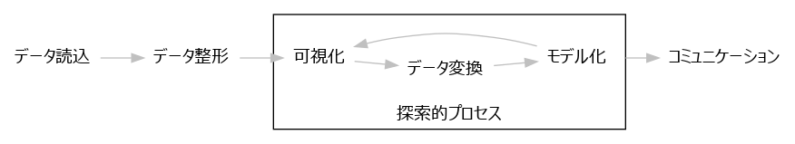

```{r setup, include=FALSE}
knitr::opts_chunk$set(echo = TRUE, fig.align="center")

library(ggpubr)
library(cowplot)
library(tidyverse)
library(broom)

options(digits = 5)
```

## データ処理は探索的プロセス

実験データ分析は、探索的なプロセスです。
1回データ処理して終了することはあまりなく、多くの場合は仮説→検証を繰り返して適切な結果を得ることができます。
ここではRの可視化処理を使って、その簡単な例を示します。




## 実験データを読み込む

ここでは読み込みの手順は省略し、Rに組み込みのテスト用データを使うことにします。
使用するデータは生態学の計測データで、アヤメの花弁（petal）とガク（sepal）の長さと幅を、3つの種について50個体ずつ計測したデータです。

```{r, echo=FALSE}
iris <- iris %>% as_tibble()
print(iris, n = 5)
```

## 分析しやすいよう整形する

元々のデータでは部位ごとの計測項目が変数（列）になっていましたが、部位を変数にした方が扱いやすいと思います。
そこで、以下のように整形します。

```{r tidyr, echo=TRUE}
iris_long <- iris %>% 
  rownames_to_column("id") %>% 
  mutate(id = as.integer(id)) %>% 
  gather(key, value, matches("Length|Width")) %>% 
  separate(key, into = c("Part", "amount")) %>% 
  spread(amount, value)
```
```{r, echo=FALSE}
print(iris_long, n = 5)
```

## 可視化する

それでは、データを確認するために可視化してみましょう。
長さと幅の関係を種ごと部位ごとに確認してみることにします。

```{r 1st_plot, echo=TRUE, eval=FALSE}
iris_long %>% 
	ggplot(aes(x = Width, y = Length)) + 
	geom_point(aes(color = Part)) + 
	stat_smooth(method = "lm", color = "gray 40") + 
	facet_grid(Part ~ Species) +
	labs(x = "Width(cm)", y = "Length(cm)")
```

## 可視化する

比較的よい相関があるようですが、よく見てみると、どの種でもガクの方が大きいようです。  

```{r 1st_plot, echo=FALSE, eval=TRUE}
```

## 仮説その1

もしかすると、長さと幅の関係は花弁とガクで共通と考えたほうがいいのかもしれません。
確認してみましょう。

```{r theory_1, echo=TRUE, eval=FALSE}
iris_long %>% 
	ggplot(aes(x = Width, y = Length)) + 
	geom_point(aes(color = Part)) + 
	stat_smooth(method = "lm", color = "gray 40") + 
	facet_wrap(~ Species) +
	labs(x = "Width(cm)", y = "Length(cm)")
```

## 仮説その1

よい相関があるので、仮説は妥当だったようです。
更に見てみると、近似直線の傾きがどれも似ているようです。

```{r theory_1, echo=FALSE, eval=TRUE}
```

## 仮説その2

長さと幅の傾きは種が異なっても共通かもしれません。
確認してみましょう。

```{r theory_2, echo=TRUE, eval=FALSE}
iris_long %>% 
  ggplot(aes(x = Width, y = Length, color = Species)) + 
	geom_point(aes(shape = Part), size = 3) + 
	stat_smooth(method = "lm") +
	labs(x = "Width(cm)", y = "Length(cm)")
```

## 仮説その2

95%信頼区間（グレーの領域）を考慮すると、同じ傾きである可能性は高そうです。

```{r theory_2, echo=FALSE, eval=TRUE}
```

## 線形モデルの結果を数値で取得する

いままではグラフで確認していましたが、モデル化の結果を数値で取得することもできます。
係数は推定値と標準誤差がestimateとstd.errに、無相関のt検定の結果はstaticとp.valueに示されています。

```{r model, echo=TRUE}
lm_coef <- iris_long %>% 
  group_by(Species) %>% 
  summarise(list(lm(Length ~ Width) %>% tidy())) %>% 
  unnest()
```
```{r, echo=FALSE, fig.height=2.2, fig.width=5, out.height='264px', out.width='600px'}
lm_coef %>% ggtexttable(rows = NULL, theme = ggpubr::ttheme("mBlue")) %>% 
  table_cell_bg(color = "red", linewidth = 2, column = 3, row = 3) %>%
  table_cell_bg(color = "red", linewidth = 2, column = 3, row = 5) %>% 
  table_cell_bg(color = "red", linewidth = 2, column = 3, row = 7)
```

## 線形モデルの結果を数値で取得する

ここから95%信頼区間を求めるには、以下のように直接計算することもできますし、

```{r, echo=TRUE}
ci_lwr <- function(coef, err, n, p = 0.95) {
  coef -1 * err * qt(df = n - 2, p = 1 - (1 - p)/2)
}

ci_upr <- function(coef, err, n, p = 0.95) {
  coef +1 * err * qt(df = n - 2, p = 1 - (1 - p)/2)
}

lm_coef_ci <- lm_coef %>% 
  filter(term == "Width") %>% 
  group_by(Species) %>% 
  summarise(ci_lwr = ci_lwr(estimate, std.error, 100),
            ci_upr = ci_upr(estimate, std.error, 100))
```

## 線形モデルの結果を数値で取得する

以下のように信頼区間を求める関数を使うこともできます。

```{r, echo=TRUE}
lm_coef_ci <- iris_long %>% 
  group_by(Species) %>% 
  summarise(list(lm(Length ~ Width) %>% 
                   confint(., "Width") %>% as_tibble())) %>% 
  unnest()
```

その結果は以下のようになり、傾きが同一である可能性があるといえます。

```{r, echo=FALSE, fig.height=1.2, fig.width=2.2, out.height='180px', out.width='330px'}
lm_coef_ci %>% ggtexttable(rows = NULL, theme = ggpubr::ttheme("mBlue"))
```

## 線形モデルの妥当性確認

最後に、直線回帰が適切に行えているのか、残差の分布を確認してみましょう。

```{r check_lm, echo=TRUE, eval=FALSE}
lm_resid <- iris_long %>% 
  group_by(Species) %>% 
  summarise(list(lm(Length ~ Width) %>% augment())) %>% 
  unnest()

p1 <- lm_resid %>% 
  ggplot(aes(x = Width, y = .resid)) + 
  geom_point() + 
  facet_wrap(~ Species, scales = "free_x")

p2 <- lm_resid %>% 
  ggplot(aes(x = .resid)) + 
  geom_histogram(bins = 8) + 
  facet_wrap(~ Species, scales = "free_x")

plot_grid(p1, p2, ncol = 1)
```

## 線形モデルの妥当性確認

説明変数（Width）に対して残差のバラツキはほぼ均等のようですし、残差の分布も偏っていないようなので、問題ないでしょう。

```{r check_lm, echo=FALSE, eval=TRUE}
```

