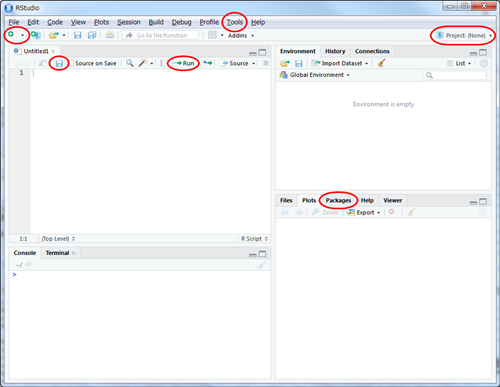

```{r setup, include=FALSE}
knitr::opts_chunk$set(echo = TRUE)
library(remoji)
```


# RStudioの使い方
Rを使うときは開発環境ツールのRStudioを起動してください。
RStudioはデータ分析作業をサポートする便利なツールです。


## 画面構成
RStudioの画面は、4つのワクから構成されています。



印をつけてあるのが、ここで使用する項目ですが、参考までにそれぞれのワクについて説明します。  

左上のワクは、後でスクリプトファイルを作成すると表示されます。
ここにRの処理を書いていきます。
左下のワクはコンソールで、Rのコマンドを実行するところです。
右上のワクにはタブが並んでいます。[Envrionment]にはデータの一覧が表示されます。
項目をクリックすると左上のワクにタブが新しくタブができて、データの内容が表示されます。
[History]には入力したコマンドの履歴が表示されます。
右下のワクには、プロジェクトフォルダに含まれるファイルを操作する[Files]、グラフなどの出力を
表示する[Plots]と[Viewer]、Rの機能を拡張するパッケージを管理する[Packages]、英語ですが
コマンドの使い方を表示する[Help]があります。


## 初期設定を行う
RStudioをインストールした後に、以下の設定を行ってください。

- 一時データを保存しないようにする。
    - メニューから[Tools -> Global Options]を選択する。
    - Restore .RData into workspace at startup: チェックを外す
    - Save workspace to .RData on exit: Never
  
- ライブラリをインストールする。
    - 右下のワクの[Packages]タブを選択する。
    - [Install]ボタンを押す。
    - [Packages]の欄に`tidyverse`と入力し[Install]を押す。


## データ分析をはじめる
新しくデータ分析をはじめるときには、以下のようにしてください。

- プロジェクトを作成する。
    - あらかじめ、プロジェクトを保存するフォルダを用意する。
    - ツールバー右端の[Project]ボタンを押す。
    - [New Project]を選び、表示された画面で[Existing Directory]を選ぶ。
    - [Browse]ボタンを押して、用意したフォルダを選択し、[Open]ボタンを押す。
    - [Create Project]ボタンを押す。
  
- Rの処理を記録するファイル（スクリプトファイル）を作成する。
    - ツールバー左端の[+]ボタンを押し、[R Script]を選ぶ。
    - 左上のワクに作られた[Untitled1]タブの下にある保存ボタン（フロッピーディスクのアイコン）を押す。
    - ファイル名を入力して[Save]ボタンを押す。（拡張子は自動で追加される。）
  
- ライブラリをインポートする。
    - スクリプトファイルの先頭に、以下を記述する。
    ```{r message=FALSE}
    library(tidyverse)
    ```
    - カーソルが先頭行にある状態で、タブ内の右上の[Run]ボタンを押す。

- 処理を書く。
  スクリプトファイルに、実行させたいコマンドを記述する。
  

## コマンドを実行する
スクリプトファイルに書いたコマンドを実行するには、実行したい行にカーソルがある状態で[Run]ボタンを押します。
すると、コンソールにコマンドが転送されて実行されます。  
複数行を実行したいときや、行内の一部分だけを実行したいときは、範囲選択した状態で[Run]ボタンを押します。
スクリプトファイルが完成した後なら、ファイルの内容を一括して実行することも可能です。
その場合は[Source]ボタンのドロップダウンメニューから[Source with Echo]を選んでください。


## ショートカットキー
よく使う演算子や操作は、ショートカットキーで入力すると便利です。
以下を使ってみてください。

: ショートカットキー

|ショートカットキー |説明              |
|:------------------|:-----------------|
|Alt + -(ハイフン)  |代入演算子 (<-)   |
|Ctrl + Shift + m   |パイプ演算子 (%>%)|
|Ctrl + Enter       |実行              |
|Ctrl + z           |Undo              |
|Ctrl + Shift + z   |Redo              |


## 入力の補完機能を活用する
RStudioではキーボードから文字を入力すると候補が表示されます。（表示されないときはTabキーを押すと表示されます。）
矢印キー（↑↓）で候補を選択してEnterキーやTabキーを押すと入力の手間を省くことができます。


# 可視化の演習
前回勉強したRによる可視化を使って、データを分析してみましょう。  
Rに組み込まれている、`diamonds`データセットを使ってデータ分析をしてください。
`diamonds`はダイヤモンドの品質と価格を格納したデータで、前回の`iris`と同じように`tidyverse`パッケージをロードすると使えるようになります。


```{r echo=TRUE, message=FALSE}
library(tidyverse)

diamonds
```

変数の説明は以下のとおりです。

:diamondデータセット

|データ列(変数) |説明             |
|:--------------|:----------------|
|carat          |重さ(カラット)   |
|cut            |カット等級       |
|color          |色               |
|clarity        |透明度           |
|x              |長さ(mm)         |
|y              |幅(mm)           |
|z              |深さ(mm)         |
|depth          |深さ比(z/(x+y)/2)|
|table          |上面幅/最大幅    |


## 演習1
ダイヤモンドのカラットと価格には相関があるでしょうか？
グラフを描いて調べてください。


## 演習2
カラットと価格の関係は、カット等級によって変化するでしょうか？
カット等級ごとのサブグラフを描いて調べてください。


